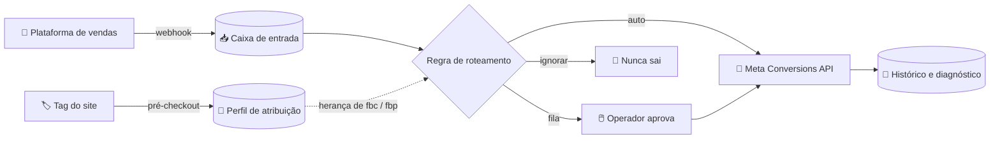
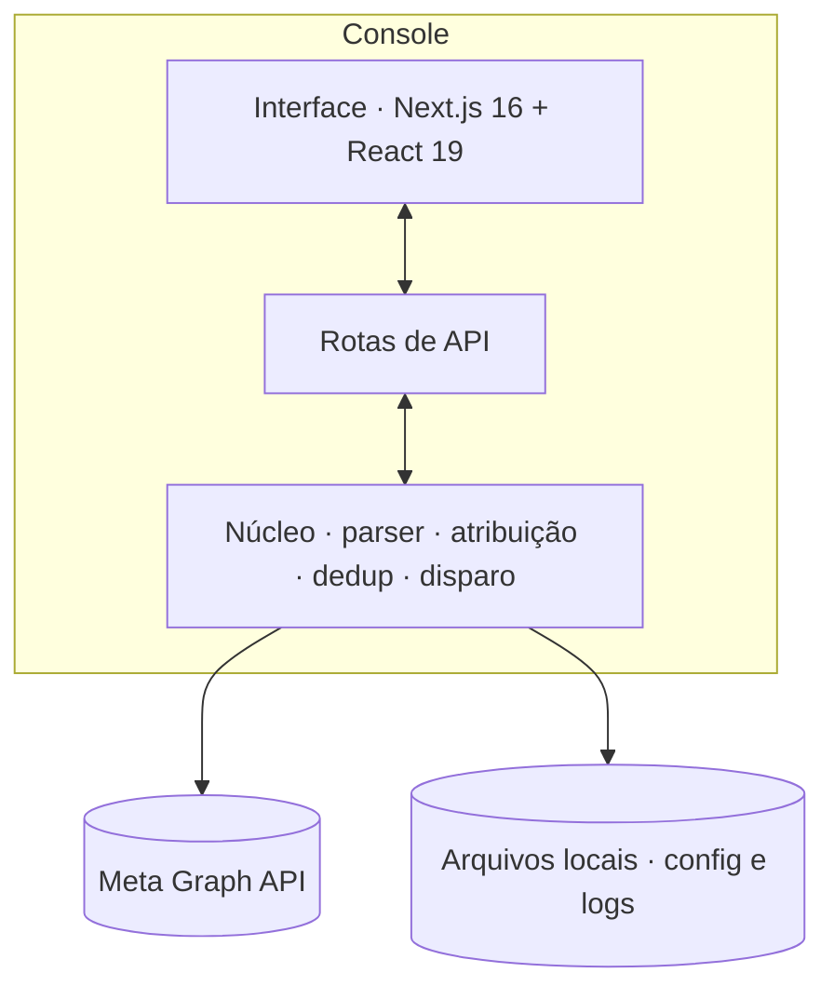

<div align="center">


[](https://nextjs.org)
[](https://react.dev)
[](https://www.typescriptlang.org)
[](https://tailwindcss.com)
[](https://developers.facebook.com/docs/marketing-api/conversions-api)

[](https://github.com/AbnerSantosss/capi-console/actions)
[](#qualidade)
[](#rodando)
[](#)

</div>

<br>

> **Uma venda por PIX é confirmada minutos depois de o comprador fechar a aba.**
> O Pixel do navegador já não está lá para contar. A campanha que trouxe aquela
> pessoa fica sem a conversão — e o algoritmo da Meta aprende com o que vê.
>
> O CAPI Console fecha esse buraco: recebe o que a plataforma de vendas avisa
> por webhook, junta com a atribuição capturada antes do checkout e entrega a
> conversão pela **API de Conversões**, com deduplicação e sem inventar nada.

<br>

## O que ele faz



| | |
|---|---|
| **Recebe** | webhooks de compra, PIX gerado, abandono, estorno — de qualquer plataforma que fale JSON |
| **Entende** | qual evento da Meta cada aviso vira, para qual Pixel, e se deve sair sozinho, esperar um clique ou nunca sair |
| **Completa** | a venda chega sem `fbc`; o console devolve a atribuição guardada no pré-checkout, por e-mail ou telefone |
| **Protege** | filtra testes da equipe, deduplica por Pixel e evento, e nunca dispara duas vezes a mesma venda |
| **Mostra** | painel por período, atribuição por plataforma de anúncio, qualidade de correspondência (EMQ) e o rastro de cada envio |
| **Escala** | multi-empresa: cada marca com o próprio Pixel, token e regras |

<br>

## Princípios que não se negociam

- **Só evento real.** Nada de conversão fictícia — estraga o aprendizado da campanha e viola os termos da Meta.
- **Segredo não atravessa a fronteira.** O token da API vive só no servidor; o navegador recebe `temToken: true` e nada mais. Um teste automatizado garante isso a cada build.
- **Nada dispara sozinho antes de você ver funcionando.** Toda regra nasce em `fila`; o modo automático é uma decisão explícita, por marca.
- **Acessível de verdade.** Todo par de cor da interface é medido contra a WCAG 2.2 no CI. Se um token quebrar o mínimo, o build falha.

<br>

## Por dentro



- **Sessão assinada** (HMAC-SHA256) em vez de Basic Auth — sem popup, sem cabeçalho em texto puro, com limite de tentativas.
- **Tempo real** — a caixa de entrada atualiza por SSE assim que o webhook chega.
- **Persistência em arquivo** — sem banco de dados; configuração e histórico ficam em volumes fora do repositório.
- **Design system próprio** — grafite quente, um número grande por tela, tabelas para dinheiro, ícones [Phosphor](https://phosphoricons.com), e um *gate* de oito verificações de contraste que roda antes de qualquer commit.

<br>

## Rodando

```bash
npm install
cp env.example .env.local   # preencha Pixel, token e senha do console
npm run dev                 # http://localhost:3333
```

Em produção o console roda em **Docker**, com a imagem publicada no GHCR pelo
workflow deste repositório. Credenciais entram por variáveis de ambiente do
orquestrador — nunca por arquivo versionado. `config/` e `logs/` são volumes.

<br>

## Qualidade

```bash
npm run check
```

Um comando, tudo em sequência: lint, tipos, **contraste WCAG**, **varredura de
segredos** e as suítes de teste do parser, da atribuição, da deduplicação, da
sessão, das rotas e do disparo automático. Os exemplos de webhook usados nos
testes são gerados com a data de hoje, porque a Meta rejeita evento com mais de
sete dias.

<br>

<div align="center">

**Feito para o Código Vencedor.** Detalhes de operação, infraestrutura e
integrações ficam na documentação interna, fora deste repositório.


</div>
